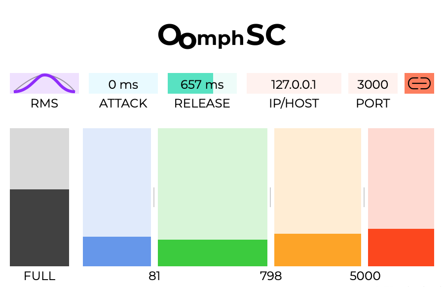

# OomphSC
Audio Plug-in which figures out the Oomph of a signal (RMS and 4-band RMS) and sends it to whoever wants to know (via OSC).

## Motivation

The idea is to insert this plug-in before spatialization, combine the energy data with panning information, and create amazing real-time visuals in full-domes.
